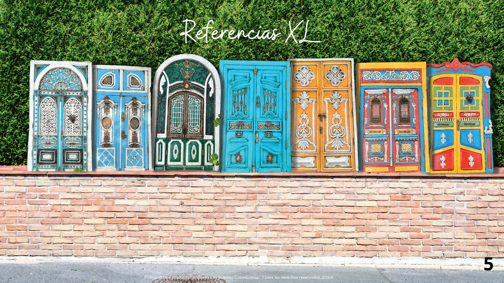

# 🚪 Puertas Colombia

<p align="center">
  
</p>

<p align="center">
  <strong>Arte · Color · Historia</strong>
</p>

<p align="center">
  Portal web tipo e-commerce para la marca <strong>Puertas Colombia</strong>, una empresa dedicada a crear piezas artesanales inspiradas en puertas, fachadas, portones, aldabas y elementos arquitectónicos tradicionales de Colombia.
</p>

<p align="center">
  
  
  
  
</p>

---

## 📌 Descripción del proyecto

**Puertas Colombia** es un portal empresarial y comercial desarrollado como proyecto final para la materia **Negocios en Internet**.

El sitio presenta una experiencia de compra inspirada en plataformas como **Amazon**, pero adaptada a una marca artesanal colombiana. El portal permite explorar productos, revisar detalles, agregar artículos al carrito, simular pagos, dejar comentarios y contactar a la empresa por redes sociales o WhatsApp.

El proyecto busca demostrar la viabilidad de una empresa virtual tipo startup, integrando comercio electrónico, marketing digital, herramientas colaborativas, redes sociales, catálogo de productos y validación con usuarios.

---

## 🌎 Identidad de marca

**Puertas Colombia** nace con la idea de rescatar el valor histórico y cultural de las puertas tradicionales del país.

Cada pieza representa una parte de la arquitectura colombiana, inspirada en regiones como:

- Bogotá
- La Candelaria
- Usaquén
- Cartagena
- Mompox
- Barranquilla
- Girón
- Santa Marta
- Filandia
- Popayán
- Riohacha
- Salamina

La marca mezcla:

```text
Arte + Color + Historia + Tradición + Funcionalidad
